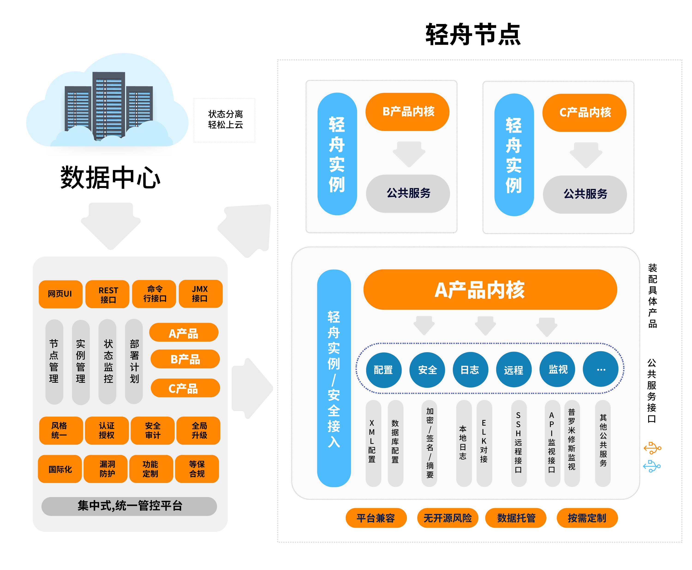

= QingZhou（轻舟）软件管理平台

:encoding: utf-8
:toc-title: 目录
:toc: macro
:numbered:
:ziti: images/sim_images

== 介绍
轻舟，提供了一套开发Web管理软件的基础平台，基于声明式API、充血模型等思想，开发者只需编写后端业务模型代码，即可自动获得前端页面，并自动化实现参数校验、REST接口、远程管理、角色权限、页面国际化、云上对接等能力。

Business value: Quickly and centrally develop, configure, and observe your business systems

== 软件架构

== 安装教程

. 打包，在项目根目录执行 `mvn clean package` 命令，之后在 `package/qingzhou/target/qingzhou/qingzhou` 可得到安装包。

. 安装，将安装包复制到目标目录即完成安装。注：若安装包为压缩文件，则需自行解压。

== 使用说明

. 确保已具备 java 环境。
. 进入安装目录，在 bin 目录下根据操作系统平台执行对应的 start 脚本即完成启动。
. 可选，免脚本启动方式：`java -jar ~/qingzhou/bin/qingzhou-launcher.jar server start`

== 参与贡献

1. Fork 本仓库
2. 新建 Feat_xxx 分支
3. 提交代码
4. 新建 Pull Request
