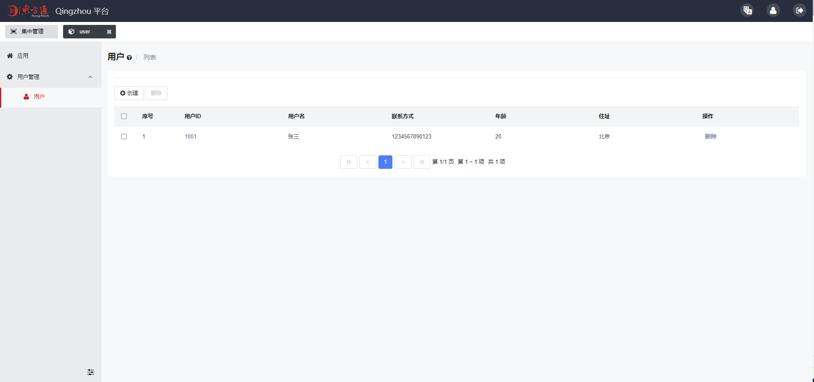

# Qingzhou（轻舟）Web管理软件开发平台

## 平台简介

轻舟是一款开源的轻量级软件开发平台，可用于简化Web管理控制台的开发。

### 主要特性

轻舟具有免前端开发、接口多样化、支持上云等特点，预置了多种Web管理常用的功能，如认证授权、漏洞防护、国际化、菜单定制等。更重要的是，它天然支持在分布式环境下对各业务系统实施集中式的管理。

### 运行环境

JDK >= 1.8

## 安装使用

1. **获取安装包**
   
   在项目根目录执行 `mvn clean package` 命令，即可在 `package/target/qingzhou` 中获取到安装包。


2. **启动平台服务**
   
   方式一：
   >+ 进入安装包根目录。
   >+  在 bin 目录下，根据操作系统平台执行对应的 `start` 脚本即开始启动。

   方式二：选择执行与平台无关的 java 命令来启动，如下所示。
   >+ 找到 `qingzhou-launcher.jar`所在目录
   >+ 执行命令`java -jar ./qingzhou-launcher.jar server start`

3. **启动成功标识**

   若看到类似如下的日志输出，则表示启动完成。
   ```
   Open a browser to access the Qingzhou console: http://localhost:9000/console。
   ```

4. **访问控制台**
   
   平台服务启动完成后，可打开浏览器访问轻舟的可视化管理平台：
   
   [http://localhost:9000/console](http://localhost:9000/console)

## 应用开发

基于轻舟开发应用，只需简单的几步：

1. 在 IDE 中建立一个 Java 项目工程。<br><br>
2. 在工程里引入轻舟的开发工具包。

   ```xml
      <dependency>
         <groupId>qingzhou</groupId>
         <artifactId>qingzhou-api</artifactId>
      </dependency>
   ```
---   
#### 入口类 
3. 创建一个类作为应用的入口，使其实现 `qingzhou.api.QingzhouApp` 接口。

   该类在 `qingzhou-api` 内，后文提到的轻舟的类也都在其内。

   实现 `start` 方法以定制应用的启动逻辑。`start` 方法会接收一个 `qingzhou.api.AppContext` 的实例对象，应用通过该对象与平台交互。<br><br>

4. 给入口类添加 `@App` 注解，以使得轻舟可以识别到它。

   ```java
   @App
   public class App implements QingzhouApp {
    
       @Override
       public void start(AppContext appContext) throws Exception {
          //应用启动逻辑
   
          appContext.addMenu("User", 
            new String[]{"用户管理", "en:User"}, "cog", 1);//添加父级菜单
       }

       @Override
       public void stop() throws Exception {
           //应用停止
       }
   }
   ```
---   
#### 模块类
5. 创建应用的模块类，使其继承自 `qingzhou.api.ModelBase`。

   对该类添加 `@Model` 注解以设置模块的名称、图标、菜单、国际化等信息。
   
   在该类内部创建 **public** 的属性（自动对应到页面上的表单元素），并对其添加 `@ModelField`
   注解以设置属性的相关信息。
   
   在该类内部创建方法（自动对应到页面上的按钮或链接），并对其添加 `@ModelAction`
   注解以设置方法的相关信息。
   
   关于配置的具体接口，可查看对应的Javadoc。

   ```java
    @Model(code = "user",//模块名称
    icon = "user",//图标
    menu = "User",//所属菜单
    name = {"用户", "en:User"},//当菜单块名
    info = {"这是一个用户模块。", "en:Menu description."})//菜单描述
    public class User extends ModelBase implements Createable {
          @ModelField(
            list = true,
            name = {"用户ID", "en:User ID"},
            info = {"用户ID。", "en:User ID."})
    public String id;
    @ModelField(
            list = true,
            name = {"用户名", "en:User Name"},
            info = {"用户的姓名。", "en:User name."})
    public String name;
    @ModelField(
            list = true,
            name = {"联系方式", "en:Property"},
            info = {"用户的联系方式。", "en:Contact information for the user."})
    public String tel;
    @ModelField(
            list = true,
            min = 1,
            max = 200,
            name = {"年龄", "en:Property"},
            info = {"用户的年龄。", "en:User age."})
    public int age;
    @ModelField(
            list = true,
            name = {"住址", "en:Property"},
            info = {"用户住址。", "en:User address."})
    public String addr;
   }
   ```

6. 模块类根据需要实现不同的接口。

+ Createable接口：提供了创建、添加、删除、修改、更新、列表以及查看功能。
+ Deletable接口：提供了删除、列表、查看功能。
+ Listable接口：提供了列表和查看功能。
+ Showable接口：提供了查看功能。
+ Editable接口：提供了修改、更新、展示功能。
  <br>

7. 模块类中需要复写DataStore 接口中的方法，来实现数据的增删改查，接口中定义了对数据进行存储、获取、更新和删除的方法规范。
  ```java
public class User extends ModelBase implements Createable {
    @Override
    public DataStore getDataStore() {
        return dataStore;
    }

    private final DataStore dataStore = new AppDatastore();

    private static class AppDatastore implements DataStore {
        private List<Map<String, String>> users = new ArrayList<>();

        @Override
        public List<Map<String, String>> getAllData() {
            return users;//获取所有数据
        }

        @Override
        public void addData(String s, Map<String, String> map) {
            users.add(map);//添加数据
        }

        @Override
        public void updateDataById(String s, Map<String, String> map) {
            users.stream() //根据id更新数据
                    .filter(user -> user.get("id").equals(s))
                    .findFirst()
                    .ifPresent(user -> user.putAll(map));
        }

        @Override
        public void deleteDataById(String s) { //根据id删除数据
            users.removeIf(user -> user.get("id").equals(s));
        }
    }
}
   ```
8. 禁用页面的某个按钮，不在页面显示。

   需要在对应按钮`@ModelAction`中添加`disable=true`。

   ```java
   public class App extends ModelBase implements Createable {
      @ModelAction(
            disable = true,
            name = {"更新", "en:Update"},
            info = {"更新这个模块的配置信息。", "en:Update the configuration information for this module."})
      public void update(Request request, Response response) throws Exception {}
   }   
   ```
---
9. 打包工程。
+ 把项目打成zip包。
  <br>
   1. zip包下需要放项目所需的资源文件。
  <br>
   2. 需要在MANIFEST.MF 中配置 Class-Path 加入资源文件目录,MANIFEST.MF 配置内容如：`Class-Path: lib/resource.jar`。
```xml
 <!-- pom.xml文件配置参考 -->
<plugins>
    <!-- 项目jar包不包含依赖jar包 -->
    <plugin>
        <groupId>org.springframework.boot</groupId>
        <artifactId>spring-boot-maven-plugin</artifactId>
        <configuration>
            <excludes>
                <exclude>
                    <groupId>org.projectlombok</groupId>
                    <artifactId>lombok</artifactId>
                </exclude>
            </excludes>
            <includes>
                <include>
                    <groupId>nothing</groupId>
                    <artifactId>nothing</artifactId>
                </include>
            </includes>
        </configuration>
    </plugin>
    <plugin>
        <groupId>org.apache.maven.plugins</groupId>
        <artifactId>maven-jar-plugin</artifactId>
        <configuration>
            <!-- 把target/classes/下的文件导入到jar内 -->
            <classesDirectory>target/classes/</classesDirectory>
            <archive>
                <manifest>
                    <!-- 指定程序入口 -->
                    <mainClass>xx.xx.xx</mainClass>
                    <!-- 打包时 MANIFEST.MF文件不记录的时间戳版本 -->
                    <useUniqueVersions>false</useUniqueVersions>
                    <addClasspath>true</addClasspath>
                    <!-- 服务依赖的jar包放在lib目录下 -->
                    <classpathPrefix>lib/</classpathPrefix>
                    <addDefaultImplementationEntries>true</addDefaultImplementationEntries>
                </manifest>
                <manifestEntries>
                    <!--MANIFEST.MF 中 Class-Path 加入资源文件目录 -->
                    <Class-Path>./config/</Class-Path>
                </manifestEntries>
            </archive>
            <outputDirectory>${project.build.directory}</outputDirectory>
        </configuration>
    </plugin>

    <!-- 分离打包关键代码 maven-dependency-plugin -->
    <plugin>
        <groupId>org.apache.maven.plugins</groupId>
        <artifactId>maven-dependency-plugin</artifactId>
        <executions>
            <execution>
                <id>copy-dependencies</id>
                <phase>package</phase>
                <goals>
                    <goal>copy-dependencies</goal>
                </goals>
                <configuration>
                    <type>jar</type>
                    <includeTypes>jar</includeTypes>
                    <!-- 存放服务依赖的jar包，存放在服务相同目录的lib文件夹下 -->
                    <outputDirectory>
                        ${project.build.directory}/lib
                    </outputDirectory>
                </configuration>
            </execution>
        </executions>
    </plugin>        
</plugins>
```

+ 把项目打成jar包。
   <br>
   1. 所依赖的包需要打到当前项目的jar中。
```xml
 <!-- pom.xml文件配置参考 -->
<plugin>
    <artifactId>maven-assembly-plugin</artifactId>
    <configuration>
        <archive>
            <manifest>
                <mainClass>xx.xx.xx</mainClass><!--程序入口-->
            </manifest>
        </archive>
        <descriptorRefs>
            <descriptorRef>jar-with-dependencies</descriptorRef>
        </descriptorRefs>
    </configuration>
    <executions>
        <execution>
            <id>make-assembly</id>
            <phase>package</phase>
            <goals>
                <goal>single</goal>
            </goals>
        </execution>
    </executions>
</plugin>
```

10. 访问轻舟的可视化管理平台，在`应用`模块下，安装上述应用的 jar 包或者 zip 包，至此，已完成应用的开发和部署。
<br><br>
11. 后续，可通过轻舟的可视化管理平台对应用进行管理。 
<br><br>
12. 页面展示


## 鸣谢

本项目借鉴和引用了一些优秀项目的设计思路或代码库文件，在此特别感谢原作者的贡献与付出，同时也感谢众多小伙伴们提出项目问题、贡献代码等！

相关项目：

【前端】

+ Muuri ([https://github.com/haltu/muuri](https://github.com/haltu/muuri))
+ marked ([https://github.com/markedjs/marked](https://github.com/markedjs/marked))
+ Multiple Select ([http://multiple-select.wenzhixin.net.cn](http://multiple-select.wenzhixin.net.cn))
+ Layui layer ([https://gitee.com/layui/layer](https://gitee.com/layui/layer))
+ ZUI ([https://openzui.com](https://openzui.com))
+ jQuery ([https://jquery.com](https://jquery.com))

【后端】

+ Javassist ([http://www.javassist.org](http://www.javassist.org))
+ Gson ([https://github.com/google/gson](https://github.com/google/gson))
+ Apache MINA SSHD ([https://mina.apache.org/sshd-project/](https://mina.apache.org/sshd-project/))
+ tinylog ([https://tinylog.org](https://tinylog.org))
+ Apache Tomcat ([https://tomcat.apache.org](https://tomcat.apache.org))

## 参与贡献
贡献让开源社区成为一个非常适合学习、启发和创新的地方。您所作出的任何贡献都是**受人尊敬**的。

如果您有好的建议，请复刻（fork）本仓库并且创建一个拉取请求（pull request）。你也可以简单的创建一个议题（issue），并且添加标签『enhancement』。
不要忘记给项目点一个star！再次感谢！

1. Fork [本仓库](https://gitee.com/openeuler/qingzhou)
2. 新建您的 Feature 分支(`git checkout -b feature/AmazingFeature`)
3. 提交您的变更(`git commit -m 'Add some AmazingFeature'`)
4. 推送到该分支(`git push origin feature/AmazingFeature`)
5. 创建拉取请求(Pull Request)
