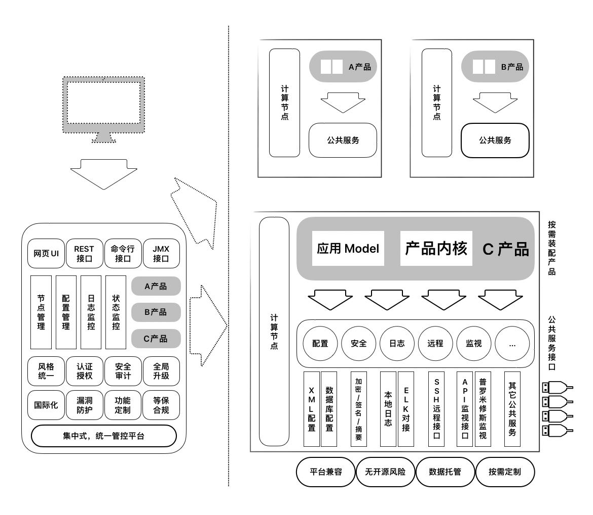

# 轻舟软件运行时管理平台

## 平台简介

轻舟，提供了一套轻量的开发框架，可用于实现对分布式软件系统的集中式管理，包括远程安装、参数配置、资源创建、状态监控、文件传输、日志记录、系统对接等等，同时内置了认证授权、风险防护、资源隔离等安全机制，力求为业务系统提供简单、快速且功能完备的开发与管理一体化支撑能力。

## 软件架构

## 安装使用

1. 安装：在项目根目录执行 `mvn clean package` 命令，之后在 `package/qingzhou/target/qingzhou/qingzhou` 可得到安装包。 
2. 启动：进入安装包根目录，在 bin 目录下，根据操作系统平台执行对应的 start 脚本即开始启动，看到类似如下的日志则表示启动完成：`Open a browser to access the QingZhou console: http://localhost:9000/console`。
3. 【可选】免脚本启动方式：`java -jar ~/qingzhou/bin/qingzhou-launcher.jar server start`。 
4. 访问：启动完成后，可打开浏览器访问轻舟的可视化管理平台： [http://localhost:9000/console](http://localhost:9000/console)

## 鸣谢

本项目开发过程中，借鉴和引用了许多优秀项目的设计思路或代码库文件等，在此特别感谢原作者的贡献付出！同时也感谢众多小伙伴提出项目问题及贡献代码.

主要引用到的项目：

+ marked ([https://github.com/markedjs/marked](https://github.com/markedjs/marked))
+ Multiple Select ([http://multiple-select.wenzhixin.net.cn](http://multiple-select.wenzhixin.net.cn))
+ Layui layer ([https://gitee.com/layui/layer](https://gitee.com/layui/layer))
+ ZUI ([https://openzui.com](https://openzui.com))
+ jQuery ([https://jquery.com](https://jquery.com))
+ Apache Tomcat ([https://tomcat.apache.org](https://tomcat.apache.org))
+ Apache MINA SSHD ([https://mina.apache.org/sshd-project/](https://mina.apache.org/sshd-project/))
+ tinylog ([https://tinylog.org](https://tinylog.org))
+ Apache Felix ([https://felix.apache.org](https://felix.apache.org))

## 参与贡献

1. Fork [本仓库](https://gitee.com/openeuler/qingzhou)
2. 新建 Feat_xxx 分支
3. 提交代码
4. 新建 Pull Request
