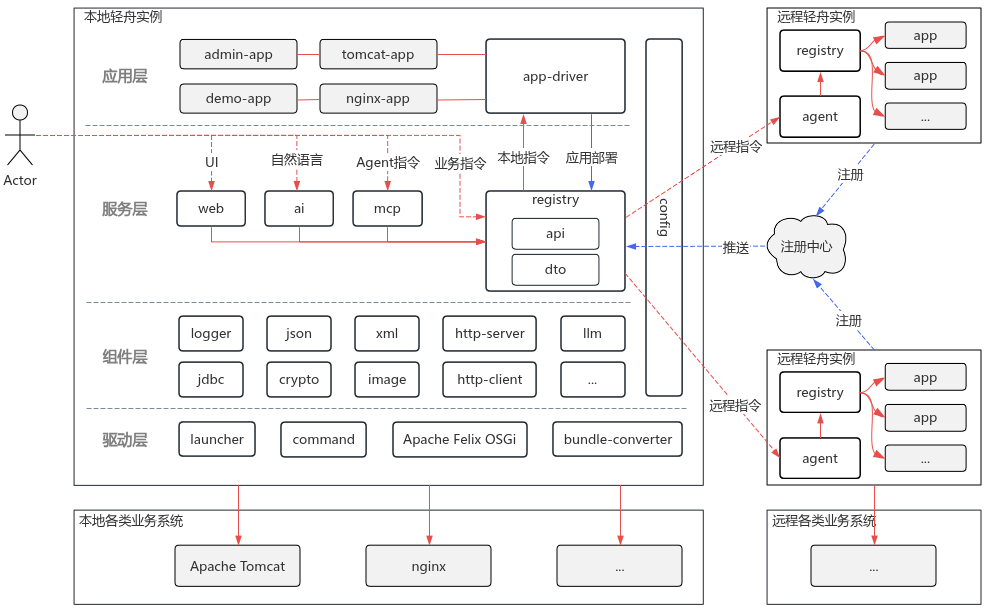

# Qingzhou（轻舟）融合管理开发平台

## 概述

Qingzhou（轻舟）是一个基于 Java
的轻量级软件开发平台，主要用于实现多品类异构业务系统的集中统一管控与智能化运维。它通过代理自动注册、插件化扩展、统一API规范、前后端分离以及大模型驱动的自然语言交互，让企业能够以标准化、低成本、高灵活性的方式，对各类业务系统进行远程管理、配置和操作，并将传统手动运维升级为意图驱动的智能管控。

### 核心特点与功能

1. **集中管理**  
   通过在服务器端部署“轻舟代理”，企业无需为每个业务系统单独配置管理入口，代理可自动发现并远程注册各类系统至“轻舟管控台”。这一机制极大降低了运维复杂度，避免了多系统分散管理带来的信息孤岛和重复劳动。同时，集中管理使得全局监控、统一配置、批量操作成为可能，显著提升企业IT治理的透明度和效率，为规模化运维奠定基础。

2. **插件化架构**  
   轻舟代理不直接固化管控逻辑，而是通过调度符合轻舟API规范的“轻舟应用”插件来执行具体操作。这种插件化设计将核心框架与业务实现解耦，新增或升级某个业务系统的管控能力时，只需增减对应插件，无需改动代理主体。其意义在于赋予系统极高的扩展性和灵活性，企业可按需组合管控能力，同时支持第三方开发者贡献插件，形成开放的生态，有效避免因业务变化导致的系统重构成本。

3. **统一规范**  
   轻舟API从接口定义、交互界面到集成模式为所有业务系统提供了一套标准开发规范。这使得原本异构、风格迥异的多个系统能够以统一的“语言”和“外观”呈现给管理员，实现真正的一致化管理。价值在于大幅降低学习成本和操作失误率，管理员无需逐个熟悉不同系统的私有操作方式；同时规范化的接口也为自动化、脚本化运维提供了坚实基础，推动企业从“人治”走向“法治”的标准化运维体系。

4. **前后端分离**  
   支持前端（如管理界面）与后端（业务逻辑及数据服务）独立部署，前端可单独托管于Nginx等高性能Web服务器。这一架构带来两大核心价值：一是前端与后端可分别弹性伸缩，应对不同压力场景，例如高并发界面访问时不挤压后端计算资源；二是开发与发布解耦，前端人员可独立迭代界面，后端专注服务稳定性，提升团队协作效率。此外，前端静态资源可借助CDN加速，进一步提升全球用户的访问体验。

5. **AI驱动的智能管控**  
   集成大模型能力后，管理员无需记忆复杂的操作路径或脚本，只需通过自然语言描述意图（如“将订单系统的超时阈值调整为30秒”），系统即可自动理解并执行相应管控逻辑。这实现了从传统手动配置、点击操作到意图驱动的根本性升级，极大降低运维门槛，甚至非技术人员也能参与日常管理。更深层的价值在于，AI可基于历史数据和上下文主动推荐优化策略、预测异常，使管控系统从被动响应转向主动智能治理，释放生产力并减少人为差错。

### 适用范围

基于轻舟“异构系统集中管控与智能运维”的定位，其最适合开发**跨系统、重管控、需标准化**的企业级管理应用（即“管理业务系统的系统”）：

1. **统一IT运维与管控类**
    - 典型场景：多云管理平台、混合云监控中心、自动化运维平台。
    - 契合点：利用“代理注册”实现跨网络节点自动接入，集中监控与批量操作解决分散运维痛点。

2. **异构业务系统聚合门户类**
    - 典型场景：企业统一管理门户（整合ERP、CRM、OA等）、跨系统数据看板。
    - 契合点：通过“插件化”适配不同底层系统，用“统一API与界面规范”屏蔽异构差异，提供一致体验。

3. **物联网与边缘设备管理类**
    - 典型场景：边缘网关管控台、分布式物联网设备监控与配置系统。
    - 契合点：代理机制天然契合边缘节点接入，插件化适合处理多品类设备的私有协议。

4. **安全与合规审计类**
    - 典型场景：统一权限治理中心、全局安全策略巡检与下发系统。
    - 契合点：集中式管控便于全局策略统一下发与审计，标准化接口适合进行跨系统合规比对。

5. **意图驱动的智能运营类**
    - 典型场景：AIOps智能运维助手、自然语言驱动的业务配置中心。
    - 契合点：发挥平台“AI+大模型”优势，将复杂的跨系统配置巡检操作转化为自然语言交互的简易指令。

> **核心结论**：轻舟平台不是用来开发具体的业务生产系统（如交易核心、订单系统）的，而是用来开发**“管理系统”的系统**
> 。凡符合“多源异构接入、集中统一管控、意图智能运维”特征的应用，均为其最佳落地场景。

### 轻舟架构图



## 快速上手

- 环境要求：JDK 1.8+ 和 Maven 3.8+。
- 构建：在源码根目录执行 `mvn clean install -DskipTests`，得到二进制产品包（/qingzhou/target/qingzhou）。
- 启动：进入产品包的 bin 目录，执行启动脚本（如 Linux/macOS 下执行 sh start.sh）。
- 访问：启动后，浏览器访问 http://localhost:7900/web 即可打开轻舟可视化 Web 管控台。

## 功能

### REST

### 远程管理

### 集成

## 更多信息

### 参数配置

参数配置文件在 `产品包/instances/default/conf/qingzhou.properties`，修改后，重启轻舟实例即可生效。

### 目录结构

轻舟二进制产品包目录结构如下：

- bin: 可执行程序目录。
    - start.sh: Linux/Mac 平台启动脚本，可以“空格+实例名”指定要启动的实例（即 instances 目录下的子文件名），默认为 default。
    - start.bat: Windows 平台启动脚本，可以“空格+实例名”指定要启动的实例（即 instances 目录下的子文件名）），默认为 default。
    - gen-cipher-key.sh: 生成随机的对称加密密钥，用于 qingzhou.crypto.Crypto.getCipher(String key) 服务。
    - gen-pair-key.sh: 生成随机的非对称公钥和私钥对，用于 qingzhou.crypto.Crypto.getPairCipher(String publicKey, String
      privateKey) 服务。
- instances: 实例数据目录，可根据用途复制多份实例，如：开发实例、测试实例等。
    - default: 默认启动的实例目录。
- lib: 存放轻舟源码编译后的二进制 *.jar 文件。
    - version*.zip: 轻舟二进制 *.jar 文件的分发 zip 包，启动时会自动解压开，解压后此文件不再需要，可删除或继续留存。
    - version* 目录: 在启动时根据 version*.zip 自动解压生成的目录，此目录下的 *.jar 文件会加载到内存。
    - 重点说明：启动时，如果 version* 目录已存在，则会与 version*.zip 比对，不一致，则删除重新生成，若要禁止此行为，可将
      version*.zip 移出此目录，或修改其名字不要以 version 开头。

### 服务接口

轻舟服务打开的接口（HTTP 协议）如下：

| 接口URI               | 接口说明          |
|---------------------|---------------|
| /registry/register  | 注册远程实例上的应用    |
| /registry/refresh   | 刷新远程实例的通信密钥   |
| /registry/invoke    | 执行指定应用的模块操作   |
| /registry/instance  | 获取已注册的实例列表    |
| /registry/app/list  | 获取已注册的应用列表    |
| /registry/app/info  | 获取特定应用的详细信息   |
| /registry/app/model | 获取特定应用的模块信息   |
| /agent              | 在远程实例上执行应用的操作 |
| /web                | 管控台前端静态资源     |
| /ai/chat            | 智能管控自然语言交互    |
| /ai/equip           | 智能管控支持的提示词配置  |

### 前后端分离

轻舟采用前后端分离架构，支持前后端独立部署。

以下是将轻舟前端独立部署到 Nginx 上的示例：

1. 前端静态资源位于源码目录 `modules/qingzhou-web/src/main/resources/webapp`。
2. 在 Nginx 配置中添加以下内容：
    ```asciidoc
    server {
        listen 8000;

        location /web {
            alias /modules/qingzhou-web/src/main/resources/webapp;
            index index.html;
            try_files $uri $uri/ /web/index.html;
        }

        location ^~ /registry/web/ {
            proxy_pass http://localhost:7900/registry/web/;
        }

        location ^~ /registry/invoke/ {
            proxy_pass http://localhost:7900/registry/invoke/;
        }

        location ^~ /ai/ {
            proxy_pass http://localhost:7900/ai/;
        }
    }
    ```
3. 启动 Nginx 服务。
4. 访问 http://localhost:8000/web 打开轻舟管控台。

### 常见问题

### 故障排除
