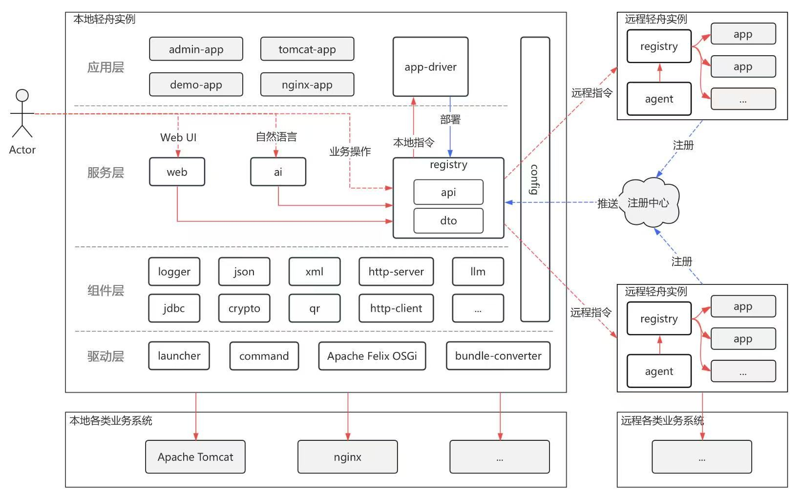

# Qingzhou（轻舟）融合管理开发平台

## 概述

Qingzhou（轻舟）是一个基于 Java 的轻量级软件开发平台，主要用于实现各类业务系统的集中式、一致化管理。

### 核心特点与功能

1. 集中管理：通过在服务器部署“轻舟代理”，可以自动识别并远程注册不同类型的业务系统到“轻舟管控台”，从而实现集中管理。
2. 插件化架构：对业务系统的管控是通过轻舟代理调度对应的“轻舟应用”（基于轻舟 API 开发的插件化组件）来完成的。
3. 统一规范：轻舟 API 为各类业务系统提供统一的开发规范，包括接口、UI、集成方式等，最终实现多品类业务系统的标准化、一致化管理。
4. 前后端分离：支持前后端独立部署，前端可单独部署到 Nginx 等 Web 服务器。
5. AI驱动的智能管控：集成大模型能力，以自然语言交互完成复杂业务系统的管控操作，实现从手动配置到意图驱动的智能化升级。

### 轻舟架构图



## 快速上手

- 环境要求：JDK 1.8+ 和 Maven 3.8+。
- 构建：在源码根目录执行 `mvn clean install -DskipTests`，得到二进制产品包。
- 启动：进入产品包的 bin 目录，执行启动脚本（如 Linux/macOS 下执行 sh start.sh）。
- 访问：启动后，浏览器访问 http://localhost:7900/console 即可打开轻舟可视化 Web 管控台。

## 功能

### REST

### 远程管理

### 集成

## 更多信息

### 参数配置

参数配置文件在 `产品包/instances/default/conf/qingzhou.properties`，修改后，重启轻舟实例即可生效。

### 目录结构

轻舟二进制产品包目录结构如下：

- bin: 可执行程序目录。
    - start.sh: Linux/Mac 平台启动脚本，可以“空格+实例名”指定要启动的实例（即 instances 目录下的子文件名），默认为 default。
    - start.bat: Windows 平台启动脚本，可以“空格+实例名”指定要启动的实例（即 instances 目录下的子文件名）），默认为 default。
    - gen-cipher-key.sh: 生成随机的对称加密密钥，用于 qingzhou.crypto.Crypto.getCipher(String key) 服务。
    - gen-pair-key.sh: 生成随机的非对称公钥和私钥对，用于 qingzhou.crypto.Crypto.getPairCipher(String publicKey, String
      privateKey) 服务。
- instances: 实例数据目录，可根据用途复制多份实例，如：开发实例、测试实例等。
    - default: 默认启动的实例目录。
- lib: 存放轻舟源码编译后的二进制 *.jar 文件。
    - version*.zip: 轻舟二进制 *.jar 文件的分发 zip 包，启动时会自动解压开，解压后此文件不再需要，可删除或继续留存。
    - version* 目录: 在启动时根据 version*.zip 自动解压生成的目录，此目录下的 *.jar 文件会加载到内存。
    - 重点说明：启动时，如果 version* 目录已存在，则会与 version*.zip 比对，不一致，则删除重新生成，若要禁止此行为，可将
      version*.zip 移出此目录，或修改其名字不要以 version 开头。

### 服务接口

轻舟服务打开的接口（HTTP 协议）如下：

| 接口URI      | 接口说明          | 访问形式                           |
|------------|---------------|--------------------------------|
| /invoke    | 执行指定应用的模块操作   | /invoke/-/admin/app/list       |
| /register  | 注册远程实例上的应用    |                                |
| /refresh   | 刷新远程实例的通信密钥   |                                |
| /agent     | 在远程实例上执行应用的操作 |                                |
| /console   | 管控台前端静态资源     |                                |
| /web/index | 管控台后端应用概览     |                                |
| /web/app   | 管控台后端应用元数据    | /web/app?appId=admin@-         |
| /web/model | 管控台后端应用模块元数据  | /web/model?modelId=app@admin@- |
| /chat      | 智能管控自然语言交互接口  |                                |

### 前后端分离

轻舟采用前后端分离架构，支持前后端独立部署。

以下是将轻舟前端独立部署到 Nginx 上的示例：

1. 前端静态资源位于源码目录 `modules/qingzhou-web/src/main/resources/webapp`。
2. 在 Nginx 配置中添加以下内容：
    ```asciidoc
    server {
        listen 8000;
    
        location /console {
            alias /Users/tw/Desktop/qingzhou/modules/qingzhou-web/src/main/resources/webapp;
            index index.html;
            try_files $uri $uri/ /console/index.html;
        }
    
        location ^~ /web/ {
            proxy_pass http://localhost:7900/web/;
        }
    
        location ^~ /invoke/ {
            proxy_pass http://localhost:7900/invoke/;
        }
    }
    ```
3. 启动 Nginx 服务。
4. 访问 http://localhost:8000/console 打开轻舟管控台。

### 常见问题

### 故障排除
