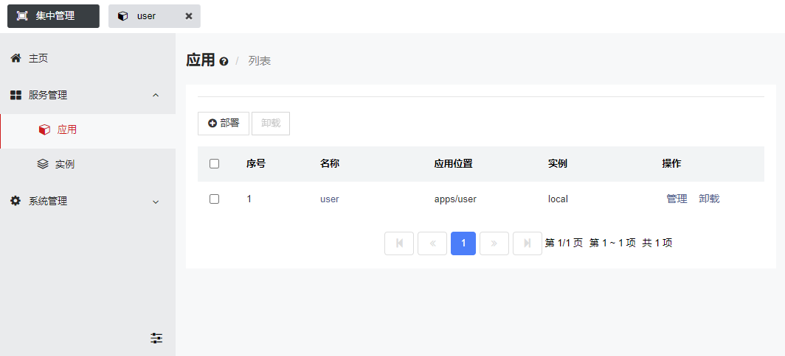

# 轻舟Web应用开发平台

## 平台简介

轻舟是一款轻量级的软件开发平台，主要用于Web应用类型软件的开发。轻舟实现了自动化的前端网页生成、后端参数校验，并内置了用户管理、权限控制、日志接口、系统升级等开箱即用的通用能力，使得开发者只需专注业务本身代码的编写即可，从而提升Web应用的开发效率。与其它类似软件相比，轻舟的特色在于，基于它所开发的Web应用是可插拔的，即在轻舟平台上可按需安装多套相同或不同类型业务系统的Web应用，并可在不需要的时候将其卸载，这正是轻舟的平台性能力所在。轻舟的愿景是为业务系统提供通用的、安全的、简单快速的，开发与管理一体化支撑能力。

### 典型用途

1. 开发一般产品的Web管控台
2. 为分布式业务系统做集中式管理

## 软件架构

### 核心逻辑

### 总体架构

#### 轻舟应用

## 安装使用

1. 安装：在项目根目录执行 `mvn clean package` 命令，之后在 `package/qingzhou/target/qingzhou/qingzhou` 可得到安装包。
2. 启动：进入安装包根目录，在 bin 目录下，根据操作系统平台执行对应的 start
   脚本即开始启动，看到类似如下的日志则表示启动完成：`Open a browser to access the Qingzhou
   console: http://localhost:9000/console`。
3. 【可选】免脚本启动方式：`java -jar ~/qingzhou/bin/qingzhou-launcher.jar server start`。
4. 访问：启动完成后，可打开浏览器访问轻舟的可视化管理平台： [http://localhost:9000/console](http://localhost:9000/console)

## 鸣谢

本项目借鉴和引用了一些优秀项目的设计思路或代码库文件，在此特别感谢原作者的贡献与付出，同时也感谢众多小伙伴们提出项目问题、贡献代码等！

相关项目：

+ Muuri ([https://github.com/haltu/muuri](https://github.com/haltu/muuri))
+ marked ([https://github.com/markedjs/marked](https://github.com/markedjs/marked))
+ Multiple Select ([http://multiple-select.wenzhixin.net.cn](http://multiple-select.wenzhixin.net.cn))
+ Layui layer ([https://gitee.com/layui/layer](https://gitee.com/layui/layer))
+ ZUI ([https://openzui.com](https://openzui.com))
+ jQuery ([https://jquery.com](https://jquery.com))
+ Apache Tomcat ([https://tomcat.apache.org](https://tomcat.apache.org))
+ Apache MINA SSHD ([https://mina.apache.org/sshd-project/](https://mina.apache.org/sshd-project/))
+ tinylog ([https://tinylog.org](https://tinylog.org))
+ Apache Felix ([https://felix.apache.org](https://felix.apache.org))

## 参与贡献

1. Fork [本仓库](https://gitee.com/openeuler/qingzhou)
2. 新建 Feat_xxx 分支
3. 提交代码
4. 新建 Pull Request
