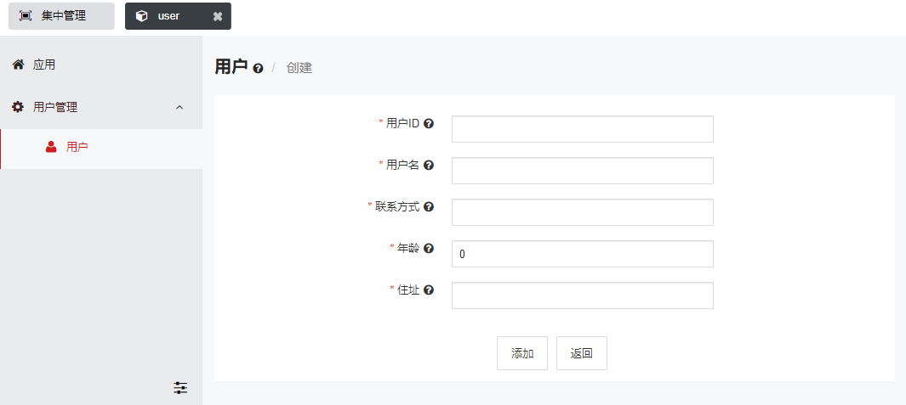
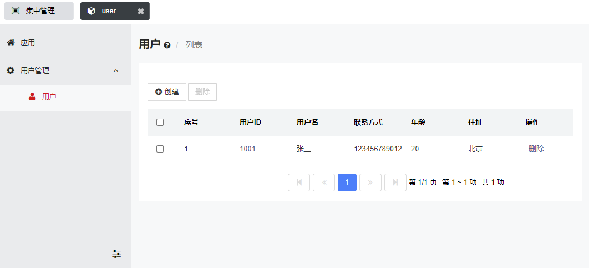

# 轻舟应用开发参考文档

## 概述

## 应用开发

基于轻舟开发应用，只需简单的几步：

1. 在 IDE 中建立一个 Java 项目工程。
2. 在工程里引入轻舟的 qingzhou-api.jar，对于 maven 项目，可通过如下方式：

   ```xml
    <dependency>
         <groupId>qingzhou</groupId>
         <artifactId>qingzhou-api</artifactId>
         <version>x</version>
         <scope>system</scope>
         <systemPath>/path/to/qingzhou/lib/versionx/qingzhou-api.jar</systemPath>
     </dependency>
   ```

---   

#### 入口类

3. 创建一个类作为应用的入口，使其实现 `qingzhou.api.QingzhouApp` 接口。

   该类在 `qingzhou-api` 内，后文提到的轻舟的类也都在其内。

   实现 `start` 方法以定制应用的启动逻辑。`start` 方法会接收一个 `qingzhou.api.AppContext` 的实例对象，应用通过该对象与平台交互。

4. 给入口类添加 `@App` 注解，以使得轻舟可以识别到它。

   ```java
   @App
   public class App implements QingzhouApp {
    
       @Override
       public void start(AppContext appContext) throws Exception {
          //添加父级菜单
          appContext.addMenu("User", 
            new String[]{"用户管理", "en:User"}, "cog", 1);
       }

       @Override
       public void stop() throws Exception {
           //应用停止
       }
   }
   ```

---   

#### 模块类

5. 创建应用的模块类，使其继承自 `qingzhou.api.ModelBase`，根据需要实现不同的接口。

```
Createable接口：提供了创建、添加、删除、修改、更新、列表以及查看功能。
Deletable接口：提供了删除、列表、查看功能。
Listable接口：提供了列表和查看功能。
Showable接口：提供了查看功能。
Editable接口：提供了修改、更新、展示功能。
```

对该类添加 `@Model` 注解以设置模块的名称、图标、菜单、国际化等信息。

在该类内部创建 **public** 的属性（自动对应到页面上的表单元素），并对其添加 `@ModelField`
注解以设置属性的相关信息。

在该类内部创建方法（自动对应到页面上的按钮或链接），并对其添加 `@ModelAction`
注解以设置方法的相关信息。

关于配置的具体接口，可查看对应的Javadoc。

   ```java
    @Model(code = "user",//模块名称
    icon = "user",//图标
    menu = "User",//所属菜单
    name = {"用户", "en:User"},//当菜单块名
    info = {"这是一个用户模块。", "en:Menu description."})//菜单描述
    public class User extends ModelBase implements Createable {
          @ModelField(
            required = true,
            list = true,
            name = {"用户ID", "en:User ID"},
            info = {"用户ID。", "en:User ID."})
    public String id;
    @ModelField(
            list = true,
            name = {"用户名", "en:User Name"},
            info = {"用户的姓名。", "en:User name."})
    public String name;
    @ModelField(
            list = true,
            name = {"联系方式", "en:Property"},
            info = {"用户的联系方式。", "en:Contact information for the user."})
    public String tel;
    @ModelField(
            list = true,
            min = 1,
            max = 200,
            name = {"年龄", "en:Property"},
            info = {"用户的年龄。", "en:User age."})
    public int age;
    @ModelField(
            list = true,
            name = {"住址", "en:Property"},
            info = {"用户住址。", "en:User address."})
    public String addr;
   }
   ```

6. 模块类中需要复写DataStore 接口中的方法，来实现数据的增删改查，接口中定义了对数据进行存储、获取、更新和删除的方法规范。

  ```java
public class User extends ModelBase implements Createable {
}
   ```

7. 打包工程。

根据项目工程结构需要，可选择jar包或zip两种格式。

+ 打成jar包需要将项目依赖打包到一起为一个jar包即可；
+ 打成zip包，则需要将上述注解标注的类所在的jar（如app.jar）放入zip包根目录，其依赖的其它资源包， 可在MANIFEST.MF 中配置 Class-Path 加入资源文件目录,MANIFEST.MF 配置内容如：`Class-Path: lib/resource.jar`。
```
zip包目录结构示意：
  - app.zip
      - lib
          - resource.jar
      - app.jar
          - MANIFEST.MF
```

8. 访问轻舟的可视化管理平台，在`应用`模块下，安装上述应用的 jar 包或者 zip 包，至此，已完成应用的开发和部署。
9. 后续，可通过轻舟的可视化管理平台对应用进行管理。
10. 页面展示





